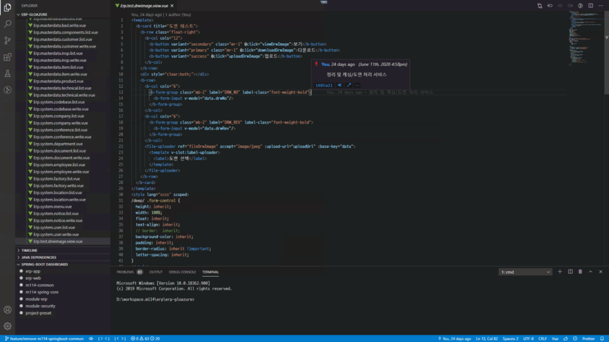
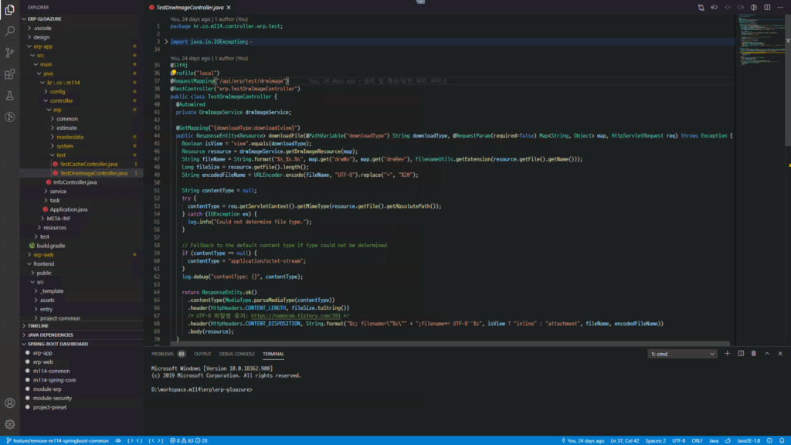
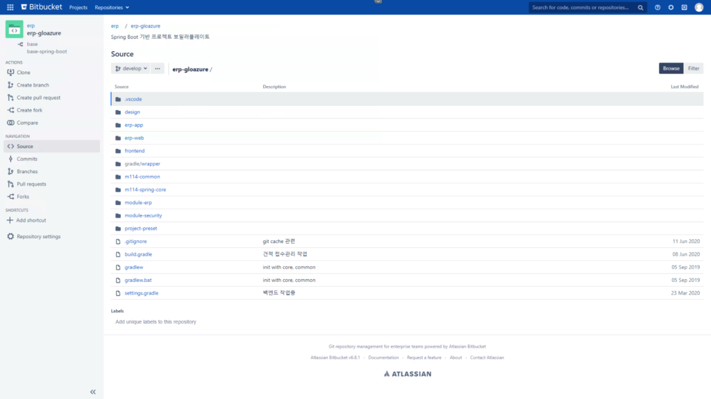
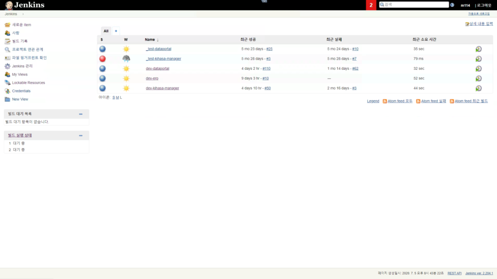
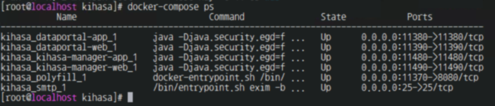
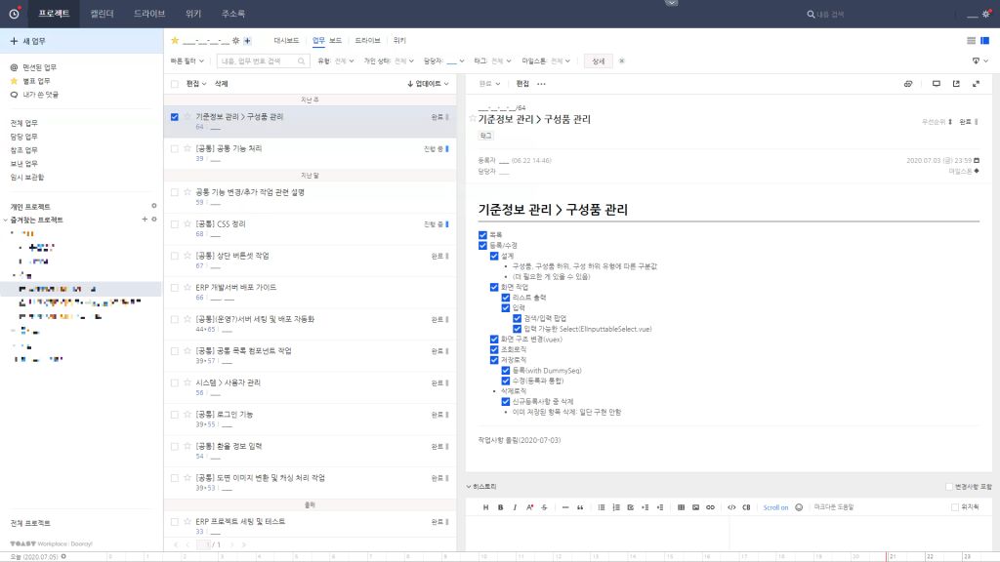

# 이런 일을 했어요
저는 일을 하면서, 단순히 웹 개발을 하는 거 외에, **개발자가 개발을 더 나은 환경에서 더 편하게 할 수 있는 환경**을 구성하는 데 많은 시간을 투자했습니다.
## 개발 프레임워크 구축

<!--  -->

기존 일반적인 Java 개발 형태인 Spring(Backend) + JSP(Frontend) + eclipse(egovFramework)에서, Spring Boot(Backend) + \[ThymeLeaf 또는 Vue CLI\](Frontend) + VSCode 환경으로 개발 프레임워크 구축
- 팀장 및 팀원들과 의논하고, 검토사항 반영
- 보일러플레이트 프로젝트 및 공통모듈을 git(bitbucket)으로 관리
- 최근(2020.05) 오픈한 고객사의 웹서비스를 구축할 때 해당 개발 프레임워크 사용하였고, 이후 작업하는 Java기반 웹서비스에 해당 프레임워크 사용중 혹은 사용예정
  - [보건복지데이터포털](https://data.kihasa.re.kr) + 관리자
  - 모 부품회사 ERP(작업중)
  - 기타 Java 프로젝트에 적용 예정

## Vue.js 도입
팀원들과의 의논 결과 신규 프로젝트에 Vue.js를 사용하기로 결정하였고, 이 Vue.js를 사내 Frontend Framework로 적용하였습니다.
- 유력한 다른 라이브러리(React.js, Angular)과 비교/검토
  - React.js 스터디하여 실 사용
- Spring Boot 프로젝트와 결합
  - Webpack 빌드 방식인 Vue CLI 3을 시범 도입
  - CDN 방식으로도 사용(외주 개발, 기존 유지보수(기능확장))
  - 시행착오 후 적용
- 팀원들에게 개발 방식 확립 후 전파(스터디/매뉴얼)

## git 도입

기존 SVN 대신 버전관리 시스템인 git를 도입하였습니다.
- Bitbucket의 Cloud 서버 방식과 사내에 서버를 두는 방식을 검토하여 결정
- 브랜치 방식 도입([예시](https://gmlwjd9405.github.io/2018/05/11/types-of-git-branch.html))
- 필요사항 학습 및 사용법(스터디/매뉴얼) 전파

## 빌드/배포 + 개발 서버/운영 서버 개선
기존 이클립스를 통해 maven 수동 빌드 후 FTP(또는 원격)으로 배포하는 방식을 크게 개선했습니다.
### gradle 도입
maven에서 문법이 더 간결한 gradle로 교체
### 빌드방식 정리
build tool에 의존한(이클립스) 방식에서 CLI 방식으로 교체(->빌드 자동화 가능)
### jenkins 도입

자동 배포를 위해 서버에 jenkins를 설치하고, **git 브랜치에 소스 반영 시 자동 빌드가 이루어지도록** 환경 구성
### docker 도입

서비스들을 컨테이너화하고, 간소화된 설정 및 일괄 관리 가능하도록 환경 구성
- docker-compose를 활용한 설정파일 구성
- jenkins, 3rd-party service들도 docker container화

## 협업 툴 도입
메일로만 이루어지던 업무 방식을 개선하고, 업무 히스토리를 남기기 위해 도입했습니다.
### Dooray 도입

- Jira, Flow, Jandi 등 협업툴 테스트/비교
- 회사에 맞는 툴 적용(사용이 쉽고, 가격이 저렴하고 등...)

---
